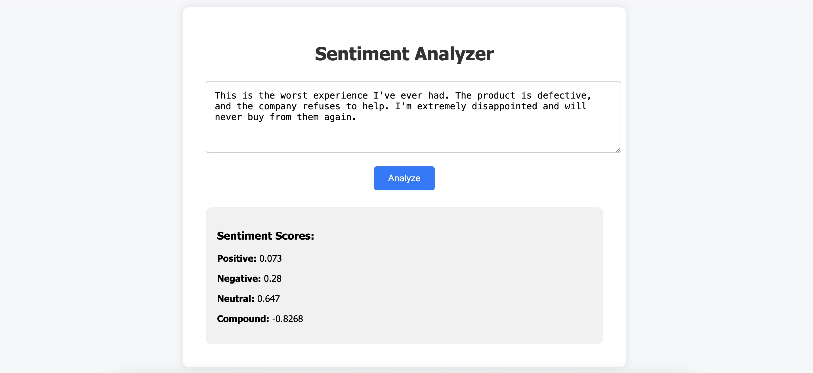

# 🧠 Sentiment Analyzer Web App

A simple web application that analyzes the sentiment of input text using Flask and VADER Sentiment from NLTK. It calculates positive, negative, neutral, and compound scores and shows them in real time via a user-friendly interface.

## 🚀 Features

- 📝 Enter any text to analyze sentiment
- ⚡ Real-time results (AJAX-powered)
- 🧠 Uses VADER sentiment scoring (via NLTK)

## 📸 Demo Screenshot



## 🛠 Tech Stack

- **Backend:** Flask, NLTK, VADER Sentiment
- **Frontend:** HTML, CSS, JavaScript (Fetch API)

## 📦 Setup Instructions

### 1. Clone the Repository

```bash
git clone https://github.com/k4rnvr/sentiment-analyzer.git
cd sentiment-analyzer
pip install -r requirements.txt
python app.py